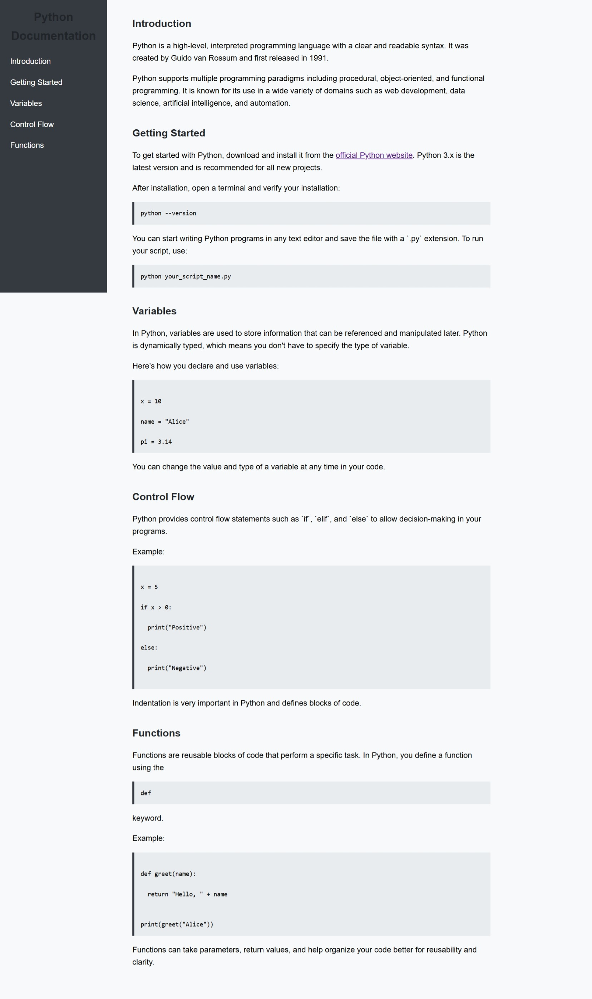

# 🐍 Python Technical Documentation

This is a simple technical documentation page about **Python**, created as part of the [freeCodeCamp Responsive Web Design Certification](https://www.freecodecamp.org/learn/2022/responsive-web-design/).

It covers the basics of Python programming — from getting started to writing functions — all styled using plain HTML and CSS.

## 📚 What’s Inside?

The documentation includes the following sections:

- **Introduction** – A quick overview of Python
- **Getting Started** – How to install and run Python
- **Variables** – Learn how variables work in Python
- **Control Flow** – Make decisions with `if`, `elif`, and `else`
- **Functions** – Create reusable blocks of code

Each section is accessible via a fixed side navigation bar that scrolls smoothly to the content.

## 💻 Built With

- HTML5
- CSS3 (Flexbox, custom styling)
- Accessibility-friendly structure
- Smooth scrolling for a better reading experience

## 📸 Preview

## 📃 Project Goal

This project was built to demonstrate an understanding of:
- Semantic HTML structure
- Responsive layout using Flexbox
- Technical writing
- Smooth user navigation

---

Feel free to leave feedback or suggestions — thanks for visiting! 😊